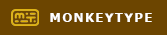

# Hi there! 👋

- [About Me](https://github.com/rn1hd#-about-me)
- [Career Journey](https://github.com/rn1hd#-career-journey)
- [Frequently Asked Questions (FAQ)](https://github.com/rn1hd#-frequently-asked-questions-faq)
- [Skills](https://github.com/rn1hd#-skills)
- [Profiles](https://github.com/rn1hd#-profiles)

## 👨‍🦰 About Me

[Back to Top](https://github.com/rn1hd#hi-there-)

- I am a **Software Developer** with professional experience in web development, automation testing, and design thinking. I am currently focusing on acquiring new skills related to modern technologies dominant in the job market.
  - **Machine Learning Engineer** is my dream job because with the current trend in the market today, Artificial Intelligence is the technology of the future and being a part of the development team someday will contribute a lot to the society, observing how **[ChatGPT](https://openai.com/blog/chatgpt/)** becomes a trend on the headlines in the 1st quarter of 2023. Working in an Artificial Intelligence department is where I am passionate about. Personally, I would love to develop a robotics system using Reinforcement Learning to prioritize unaccompanied people that no one will be with them for the rest of their lives. Instead of letting unaccompanied people feel alone, a robot will take over as a last resort to spend some time on emotional support, home assistance, and personal care.
  - **Full Stack Developer** is one of the promising goals for my career path, in fact there are more opportunities in the job market. This role can be beneficial when there are dead-end situations in the business that need to be resolved as soon as possible.
- Outside in the world of technology, I am also a professional **pianist** using an upright piano with the brand of **[Lyric](https://www.lyric.ph/)** originated in the Philippines.
- I have attached my resume [here](https://raw.githubusercontent.com/rn1hd/rn1hd/main/Resume/Resume.jpg).

 

## 🚀 Career Journey

[Back to Top](https://github.com/rn1hd#hi-there-)

- [Pianist](https://github.com/rn1hd#pianist-)
- [Game Developer](https://github.com/rn1hd#game-developer-)
- [Transcriptionist](https://github.com/rn1hd#transcriptionist-)
- [Software Developer](https://github.com/rn1hd#software-developer-)
- [Technical Writer](https://github.com/rn1hd#technical-writer-)
- [Creative Designer](https://github.com/rn1hd#creative-designer-)

### Pianist 🎹

[Back to Top (Career Journey)](https://github.com/rn1hd#-career-journey)

- My motivation to become a pianist started at 13 years old when my father bought an electronic piano.
- I enrolled on a summer piano class in **Regis Benedictine Academy** located in Batangas City, Philippines at 15 years old.
- With continuous learning and motivation, my piano skills developed over time ranging from ability to play nursery rhymes up to iconic songs adaptation and classical music.
- I have experienced playing grand piano in **Pontefino Hotel** and **Robinsons Mall Lipa** since the last quarter of the year 2022.

### Game Developer 🎮

[Back to Top (Career Journey)](https://github.com/rn1hd#-career-journey)

- My position to become a **Notecharter** started at 16 years old when I saw a [Youtube video](https://www.youtube.com/watch?v=UHHHXRU1-T0) discussing how to create musical notes that synchronizes to the beat of the song.
- With continuous learning and motivation, I finally got a chance to become one of the contributors in the game market following senior's advice regarding the output of my works. I met some amazing developers and panelists from around the world.
- I have experienced working in the following organizations:
  - AngelJam (2012-2013)
  - Palace of Sound (2014-2016)
  - O2Jam V3 (2014-2018)
  - iBMS 4th Age (2015)

### Transcriptionist ⌨

[Back to Top (Career Journey)](https://github.com/rn1hd#-career-journey)

- My first job in the real world as a **Data Analyst** has started on September 20, 2016, in **Accudata Inc.** located in Kumintang Ibaba, Batangas City, Philippines where excellent typing skills are required for the role to meet the company's standards. This is the time when my motivation to become a professional transcriptionist has started.
- On the second half of my entire tenure in **[IntegrityNet Solutions & Services](https://integritynet.biz/)**, I was responsible on taking charge of daily morning meeting for the development team; transcribing each team member's progress from recorded conversation which will be submitted to the Chief Technology Officer's company email for compilation.

### Software Developer 🖥

[Back to Top (Career Journey)](https://github.com/rn1hd#-career-journey)

- When I was in college, we developed **[e-Map as An Android Application Using Shortest Path Algorithm](https://ejournals.ph/article.php?id=12189)**. My oral thesis research presentation went well in **Hong Kong** with the help of my teammates and university professors.
- My job as a **Software Developer** has started on August 6, 2018, in **[IntegrityNet Solutions & Services](https://integritynet.biz/)** located in Joseling Road, Batangas City, Philippines.
- Developed the initial version of the **[Zumumu Website](https://zumumu.com/)** during the COVID-19 pandemic in the year 2020.
- Implemented automation framework for **Zumumu** applications using **[Selenium](https://www.selenium.dev/)** to track and ensure that the system is 100% working after code changes before deploying in the live server.
- Developed three websites on year 2020 for my client's startup business:
  - [Nix Daily](https://nixdaily.netlify.app/)
  - [The Ones Design](https://theonesdesign.netlify.app/)
  - [The Ones Restaurant](https://theonesrestaurant.netlify.app/)

### Technical Writer 📚

[Back to Top (Career Journey)](https://github.com/rn1hd#-career-journey)

- My job as a technical writer started when I was solely responsible for developing a full documentation on a college thesis named **[e-Map as An Android Application Using Shortest Path Algorithm](https://ejournals.ph/article.php?id=12189)**.
- My technical writer journey has continued in my real-life work experience when the owner of **[uAdmin](https://github.com/uadmin/uadmin)**, the Golang web framework has decided to give me full control on building the **[documentation](https://uadmin-docs.readthedocs.io/en/latest/)**. The owner started the documentation project during the initial stage, then was brought up to me on the following updates. The documentation has been maintained under my control during my tenure in **[IntegrityNet Solutions & Services](https://integritynet.biz/)** until version 0.7.4.

### Creative Designer 🎬

[Back to Top (Career Journey)](https://github.com/rn1hd#-career-journey)

- My job as a **Creative Designer** has started when I was working in O2Jam from 2012 to 2015 with the following responsibilities:

  - Loading images for some of my notechart projects using **Adobe Photoshop**
  - 3 difficulty notechart preview video presentations as a sneak peek on what to expect in the next month's song update using **[Vegas Pro](https://www.vegascreativesoftware.com/us/vegas-pro/)**

- This position is where I am **working in progress**.

 

## ❓ Frequently Asked Questions (FAQ)

[Back to Top](https://github.com/rn1hd#hi-there-)

- [Tell me about yourself.](https://github.com/rn1hd#tell-me-about-yourself)
- [Walk me through your resume.](https://github.com/rn1hd#walk-me-through-your-resume)
- [Why is there a gap in your employment?](https://github.com/rn1hd#why-is-there-a-gap-in-your-employment)
- [What changes have been made since you resigned?](https://github.com/rn1hd#what-changes-have-been-made-since-you-resigned)
- [How is being a creative designer related to your goal as a Full Stack Developer?](https://github.com/rn1hd#how-is-being-a-creative-designer-related-to-your-goal-as-a-full-stack-developer)
- [How is documentation development beneficial in business?](https://github.com/rn1hd#how-is-documentation-development-beneficial-in-business)
- [Why are you focusing on something different from Machine Learning Engineer?](https://github.com/rn1hd#why-are-you-focusing-on-something-different-from-machine-learning-engineer)
- [What is your greatest fear and why?](https://github.com/rn1hd#what-is-your-greatest-fear-and-why)
- [What is your ideal company?](https://github.com/rn1hd#what-is-your-ideal-company)
- [What are you looking for in a new position?](https://github.com/rn1hd#what-are-you-looking-for-in-a-new-position)
- [Why do you want to work at this company?](https://github.com/rn1hd#why-do-you-want-to-work-at-this-company)
- [Why do you want this job?](https://github.com/rn1hd#why-do-you-want-this-job)
- [Are you a team player?](https://github.com/rn1hd#are-you-a-team-player)
- [What are your greatest strengths?](https://github.com/rn1hd#what-are-your-greatest-strengths)
- [What do you consider to be your weaknesses?](https://github.com/rn1hd#what-do-you-consider-to-be-your-weaknesses)
- [Which is more important to you: the money, or the work?](https://github.com/rn1hd#which-is-more-important-to-you-the-money-or-the-work)
- [Do you consider yourself successful?](https://github.com/rn1hd#do-you-consider-yourself-successful)

#### **Tell me about yourself.**

[Back to Top (FAQ)](https://github.com/rn1hd#-frequently-asked-questions-faq)

- I am currently a **Creative Designer** in freelancing, where I handle our local customers. Before that, I worked in **IntegrityNet Solutions & Services** with exposure to web development, automation testing, and design thinking for our business clients. While I am working in progress, I would love to take the chance to become a part of a growing team in **XYZ Company**.

#### **Walk me through your resume.**

- See **[Career Journey](https://github.com/rn1hd#-career-journey)** for reference.

#### **Why is there a gap in your employment?**

[Back to Top (FAQ)](https://github.com/rn1hd#-frequently-asked-questions-faq)

- I **resigned** voluntarily to pursue other technologies for a better future within the **job market trends** and exercise my overall skills aiming for an **industry level standard**.

#### **What changes have been made since you resigned?**

[Back to Top (FAQ)](https://github.com/rn1hd#-frequently-asked-questions-faq)

- I acquired [creative design skills](https://github.com/rn1hd#creative-design), currently exercising them in my upcoming personal projects.
- My typing skills improved through competing in **[TypeRacer](https://data.typeracer.com/pit/profile?user=rnk1hd)** that can be beneficial to quickly take down notes during business meetings for future use.

#### **How is being a creative designer related to your goal as a Full Stack Developer?**

[Back to Top (FAQ)](https://github.com/rn1hd#-frequently-asked-questions-faq)

- The scope of the **Full Stack Developer** is very broad. **Design** is the third phase of **Software Development Life Cycle (SDLC)** where I can present the following:
  - Sitemaps and User Flows with client and development team coordination
  - Software prototypes that I can present to my clients for approval.
  - Promotional advertisements that I can showcase to the public community.

#### **How is documentation development beneficial in business?**

[Back to Top (FAQ)](https://github.com/rn1hd#-frequently-asked-questions-faq)

- Well-organized, easy to understand documentation prevents **technical debt** resulting in **company politics** when something goes out of control. Code refactoring is now easier with the help of documentation and even resorting to a full rewrite of an entire system, coordinating with a client again during the planning stage is now at the bare minimum.

#### **Why are you focusing on something different from Machine Learning Engineer?**

[Back to Top (FAQ)](https://github.com/rn1hd#-frequently-asked-questions-faq)

- **Machine Learning** is one of the most difficult fields that should not be taken lightly without mastering the prerequisites first. The **Full Stack Developer** role can be beneficial as a steppingstone to identify what business logic can be applied to develop Artificial Intelligence applications in the future.

#### **What is your ideal company?**

- An ideal company for me is a place that encourages personal and professional growth, promotes team collaboration and work-life balance.

#### **What are you looking for in a new position?**

- I am looking for a position where I can continue to exercise my **creative design skills**. Another thing is the chance to showcase my projects in your company. I am motivated by being able to see the impact of my work on other people, so your suggestions for improvement are important to determine what to expect for this position.

#### **Why do you want to work at this company?**

- **XYZ Company** is one of the highest-rated software development talent providers to companies worldwide. It has an amazing work culture, world class clients and projects, flexible work schedule, as well as career growth opportunities.

#### **Why do you want this job?**

- **Software developer** is the core contributor to business’ success, seeing how applications facilitate the user’s task instead of resorting to traditional approach to reach their goal. **XYZ Company** offers up-to-date technologies, so I want to be a part of it.

#### **What is your greatest fear and why?**

[Back to Top (FAQ)](https://github.com/rn1hd#-frequently-asked-questions-faq)

- **Fear of failure**. Unable to meet the company standards is uncomfortable. On the bright side of things, **failure** can be my best teacher. When it happens, I use this moment as an opportunity to identify what went wrong, what strategies should I take to solve the issue, and what adjustments should be made to prevent committing the same mistake in the future.

#### **Are you a team player?**

[Back to Top (FAQ)](https://github.com/rn1hd#-frequently-asked-questions-faq)

- It all depends on the **compatibility** of my skills, passion, and job responsibilities. If I see a **good future** of a role that I was assigned to within my **career goals**, I am willing to give a hundred percent of my time and effort to showcase what I can bring to the team to achieve the business goal on time and what other contributions I can bring to the table.

#### **What are your greatest strengths?**

- It is my **dedication** to reduce complexity of an entire system through documentation, automation testing, improve code quality, and design features based on a big picture to prevent **technical debt**. Anything else will become easier to fulfill once the primary goal has been achieved.

#### **What do you consider to be your weaknesses?**

[Back to Top (FAQ)](https://github.com/rn1hd#-frequently-asked-questions-faq)

- There are instances where I cannot **follow simple instructions** properly. This weakness gives me an initiative why taking down notes in almost every meeting, reliance on documentation, and mastering the role beforehand becomes essential.
- **Verbal communication skills** are what I also regularly practice through making video presentations, taking listening exercises, and getting myself exposed to a productive community when this opportunity arrives.

#### **Which is more important to you: the money, or the work?**

[Back to Top (FAQ)](https://github.com/rn1hd#-frequently-asked-questions-faq)

- **Work** is more important for me than money. There might be other positions available that can pay me well, but the risks outweigh more than the benefits which affect my well-being. Therefore, I would prefer staying in a job where I can see personal and professional advancement.

#### **Do you consider yourself successful?**

[Back to Top (FAQ)](https://github.com/rn1hd#-frequently-asked-questions-faq)

- Yes, when it comes to how I achieve what amazing world champions in **[TypeRacer](https://data.typeracer.com/pit/profile?user=rnk1hd)** can achieve: getting to the daily leaderboard (see Awards for reference).

 

## ⛳ Skills

[Back to Top](https://github.com/rn1hd#hi-there-)

### Web Development

  
  
  
  
  
  
  

### Software Development

  
  
  

### Documentation

  
  

### Software Testing

  
  

### Creative Design

  
  
  
  
  
  

 

## 👨‍💻 Profiles

[Back to Top](https://github.com/rn1hd#hi-there-)

  
  
  
  
  

