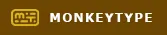

# Hi there! 👋

- [About Me](https://github.com/rn1hd#-about-me)
- [Career Journey](https://github.com/rn1hd#-career-journey)
- [Frequently Asked Questions (FAQ)](https://github.com/rn1hd#-frequently-asked-questions-faq)
- [Skills](https://github.com/rn1hd#-skills)
- [Profiles](https://github.com/rn1hd#-profiles)

## 👨‍🦰 About Me

[Back to Top](https://github.com/rn1hd#hi-there-)

- I am a **Software Developer** with professional experience in web development, automation testing, and design. Passionate on continuous learning and applying cutting-edge technologies to solve real-world problems.
  - **Machine Learning Engineer** is my dream job because with the current trend in the market today, Artificial Intelligence is the technology of the future and being a part of the development team someday will contribute a lot to the society, observing how **[ChatGPT](https://openai.com/blog/chatgpt/)** becomes a trend on the headlines in the 1st quarter of 2023. Working in an Artificial Intelligence department is where I am passionate about. Personally, I would love to develop a robotics system using Reinforcement Learning to prioritize unaccompanied people that no one will be with them for the rest of their lives. Instead of letting unaccompanied people feel alone, a robot will take over as a last resort to spend some time on emotional support, home assistance, and personal care.
  - **Full Stack Developer** is one of the promising goals for my career path, in fact there are more opportunities in the job market. This role can be beneficial when there are dead-end situations in the business that need to be resolved as soon as possible.
- I am also a professional **[pianist](https://dai.ly/k3loMuNrK90sOQzOXKu)** outside in the world of technology.
- I have attached my resume **[here](https://raw.githubusercontent.com/rn1hd/rn1hd/main/Resume/Resume.webp)**.

 

## 🚀 Career Journey

[Back to Top](https://github.com/rn1hd#hi-there-)

- [Pianist](https://github.com/rn1hd#pianist-)
- [Game Developer](https://github.com/rn1hd#game-developer-)
- [Transcriptionist](https://github.com/rn1hd#transcriptionist-)
- [Software Developer](https://github.com/rn1hd#software-developer-)
- [Technical Writer](https://github.com/rn1hd#technical-writer-)
- [Creative Designer](https://github.com/rn1hd#creative-designer-)

### Pianist 🎹

[Back to Top (Career Journey)](https://github.com/rn1hd#-career-journey)

- My motivation to become a pianist started at 13 years old when my father bought an electronic piano.
- I enrolled on a summer piano class in **Regis Benedictine Academy** located in Batangas City, Philippines at 15 years old.
- With continuous learning and motivation, my piano skills developed over time ranging from ability to play nursery rhymes up to iconic songs adaptation and classical music.
- I have experienced playing grand piano in **[Pontefino Hotel](https://www.pontefinohotel.com/)** and **[Robinsons Mall](https://robinsonsmalls.com/)** Lipa branch since the last quarter of the year 2022 in Batangas province, and several malls around National Capital Region on year 2024.

### Game Developer 🎮

[Back to Top (Career Journey)](https://github.com/rn1hd#-career-journey)

- My position to become a **Notechart Engineer** started at 16 years old when I saw a [Youtube video](https://www.youtube.com/watch?v=UHHHXRU1-T0) discussing how to create musical notes that synchronizes to the beat of the song.
- With continuous learning and motivation, I finally got a chance to become one of the contributors in the game market following senior's advice regarding the output of my works. I met some amazing developers and panelists from around the world.
- I have experienced working in the following organizations:
  - AngelJam (2012-2013)
  - OtakuJam (2013)
  - Palace of Sound (2014-2016)
  - iBMS 4th Age (2015)
  - O2Jam V3 International (2013-2018)
- See portfolio **[here](https://github.com/rn1hd/rn1hd/tree/main/Personal%20Website/Portfolio/Game%20Developer)**.

### Transcriptionist ⌨

[Back to Top (Career Journey)](https://github.com/rn1hd#-career-journey)

- My first job in the real world as a **Biller** has started on September 20, 2016, in **Accudata Inc.** located in Kumintang Ibaba, Batangas City, Philippines where excellent typing skills are required for the role to meet the company's standards. This is the time when my motivation to become a professional transcriptionist has started.
- On the second half of my entire tenure in **[IntegrityNet Solutions & Services](https://integritynet.biz/)**, I was responsible on taking charge of daily morning meeting for the development team; transcribing each team member's progress from recorded conversation which will be submitted to the Chief Technology Officer's company email for compilation.

### Software Developer 🖥

[Back to Top (Career Journey)](https://github.com/rn1hd#-career-journey)

- When I was in college, we developed **[e-Map as An Android Application Using Shortest Path Algorithm](https://ejournals.ph/article.php?id=12189)**. My oral thesis research presentation went well in **Hong Kong** with the help of my teammates and university professors.
- My job as a **Software Developer** has started on August 6, 2018, in **[IntegrityNet Solutions & Services](https://integritynet.biz/)** located in Joseling Road, Batangas City, Philippines.
- Developed the initial version of the **[Zumumu Website](https://zumumu.com/)** during the COVID-19 pandemic in the year 2020.
- Implemented automation framework for **Zumumu** applications using **[Selenium](https://www.selenium.dev/)** to track and ensure that the system is 100% working after code changes before deploying in the live server.
- Developed three websites on year 2020 for my client's startup business:
  - [Nix Daily](https://nixdaily.netlify.app/)
  - [The Ones Design](https://theonesdesign.netlify.app/)
  - [The Ones Restaurant](https://theonesrestaurant.netlify.app/)
- Developed **Purchase Request Information System** for Regional and Field Offices under **[Department of Labor and Employment](https://ncr.dole.gov.ph/)**.

### Technical Writer 📚

[Back to Top (Career Journey)](https://github.com/rn1hd#-career-journey)

- My job as a technical writer started when I was solely responsible for developing a full documentation on a college thesis named **[e-Map as An Android Application Using Shortest Path Algorithm](https://ejournals.ph/article.php?id=12189)**.
- My technical writer journey has continued in my real-life work experience when the owner of **[uAdmin](https://github.com/uadmin/uadmin)**, the Golang web framework has decided to give me full control on building the **[documentation](https://uadmin-docs.readthedocs.io/en/latest/)**. The owner started the documentation project during the initial stage, then was brought up to me on the following updates. The documentation has been maintained under my control during my tenure in **[IntegrityNet Solutions & Services](https://integritynet.biz/)** until version 0.7.4.

### Creative Designer 🎬

[Back to Top (Career Journey)](https://github.com/rn1hd#-career-journey)

- My job as a **Creative Designer** has started when I was working in several O2Jam organizations from 2012 to 2018 with the following responsibilities:

  - Loading images for some of my notechart projects using **Adobe Photoshop**
  - Multiple difficulty notechart preview video presentations as a sneak peek on what to expect in the next month's song update using **[Vegas Pro](https://www.vegascreativesoftware.com/us/vegas-pro/)**

- See portfolio **[here](https://github.com/rn1hd/rn1hd/tree/main/Personal%20Website/Portfolio/Creative%20Designer)**.

 

## ❓ Frequently Asked Questions (FAQ)

[Back to Top](https://github.com/rn1hd#hi-there-)

- [Basic Questions](https://github.com/rn1hd#basic-questions)
- [Behavioral Questions](https://github.com/rn1hd#behavioral-questions)
- [More Questions About Me](https://github.com/rn1hd#more-questions-about-me)

### **Basic Questions**

[Back to Top (FAQ)](https://github.com/rn1hd#-frequently-asked-questions-faq)

- [Tell me about yourself.](https://github.com/rn1hd#tell-me-about-yourself)
- [Walk me through your resume.](https://github.com/rn1hd#walk-me-through-your-resume)
- [Why did you leave your last job?](https://github.com/rn1hd#why-did-you-leave-your-last-job)
- [Why is there a gap in your employment?](https://github.com/rn1hd#why-is-there-a-gap-in-your-employment)
- [What did you like least about your last job?](https://github.com/rn1hd#what-did-you-like-least-about-your-last-job)
- [How is being a creative designer related to your goal as a Full Stack Developer?](https://github.com/rn1hd#how-is-being-a-creative-designer-related-to-your-goal-as-a-full-stack-developer)
- [How is documentation development beneficial in business?](https://github.com/rn1hd#how-is-documentation-development-beneficial-in-business)
- [Why are you focusing on something different from Machine Learning Engineer?](https://github.com/rn1hd#why-are-you-focusing-on-something-different-from-machine-learning-engineer)
- [When were you most satisfied in your job?](https://github.com/rn1hd#when-were-you-most-satisfied-in-your-job)
- [Are you considering other positions in other companies?](https://github.com/rn1hd#are-you-considering-other-positions-in-other-companies)
- [What other companies are you interviewing with?](https://github.com/rn1hd#what-other-companies-are-you-interviewing-with)
- [What is your ideal company?](https://github.com/rn1hd#what-is-your-ideal-company)
- [How did you hear about this position?](https://github.com/rn1hd#how-did-you-hear-about-this-position)
- [What are you looking for in a new position?](https://github.com/rn1hd#what-are-you-looking-for-in-a-new-position)
- [Why do you want to work at this company?](https://github.com/rn1hd#why-do-you-want-to-work-at-this-company)
- [What are your greatest strengths?](https://github.com/rn1hd#what-are-your-greatest-strengths)
- [What do you consider to be your weaknesses?](https://github.com/rn1hd#what-do-you-consider-to-be-your-weaknesses)

#### **Tell me about yourself.**

[Back to Top (Basic Questions)](https://github.com/rn1hd#basic-questions)

- I am a dedicated **software developer** with four years of hands-on experience in creating and maintaining dynamic websites and web applications. I graduated **Cum Laude**, which reflects my strong academic background and commitment to excellence. Over the years, I've focused on creating efficient and user-friendly applications, always striving to write clean, effective code that meets the needs of stakeholders. I'm eager to bring my skills and experience to a team where I can contribute to innovative projects.

#### **Walk me through your resume.**

[Back to Top (Basic Questions)](https://github.com/rn1hd#basic-questions)

- See **[Career Journey](https://github.com/rn1hd#-career-journey)** for reference.

#### **Why did you leave your last job?**

[Back to Top (Basic Questions)](https://github.com/rn1hd#basic-questions)

- My last role is only **temporary**. I just finished my project with them. Now, I am looking for better opportunities that will allow me to grow **professionally** and to achieve job security in your company.

#### **Why is there a gap in your employment?**

[Back to Top (Basic Questions)](https://github.com/rn1hd#basic-questions)

- I took this time to gain proficiency in **modern web technologies** and **user experience design**, which I believe makes me a more versatile and skilled developer. Your company is looking for these requirements, so I am looking forward to learning more about this position that I am applying for. I know I have a lot to offer, and I would love to show you what I can bring to the team.

#### **What did you like least about your last job?**

[Back to Top (Basic Questions)](https://github.com/rn1hd#basic-questions)

- While I appreciated the opportunity to work with proprietary technology, I am excited to work with **more widely adopted frameworks** that allow for greater community support and innovation.

#### **How is being a creative designer related to your goal as a Full Stack Developer?**

[Back to Top (Basic Questions)](https://github.com/rn1hd#basic-questions)

- The scope of the **Full Stack Developer** is very broad. **Design** is the third phase of **Software Development Life Cycle (SDLC)** where I can present the following:
  - Sitemaps, user flows, wireframes, and flowcharts with client and development team coordination
  - Software prototypes that I can present to my clients for approval.
  - Promotional advertisements that I can showcase to the public community.

#### **How is documentation development beneficial in business?**

[Back to Top (Basic Questions)](https://github.com/rn1hd#basic-questions)

- Well-organized, easy to understand documentation prevents **technical debt** when something goes out of control. Code refactoring is now easier with the help of documentation and even resorting to a full rewrite of an entire system, coordinating with a client again during the planning stage is now at the bare minimum.

#### **Why are you focusing on something different from Machine Learning Engineer?**

[Back to Top (Basic Questions)](https://github.com/rn1hd#basic-questions)

- **Machine Learning** is one of the most difficult fields that should not be taken lightly without mastering the prerequisites first. The **Full Stack Developer** role can be beneficial as a steppingstone to identify what business logic can be applied to develop Artificial Intelligence applications in the future.

#### **When were you most satisfied in your job?**

[Back to Top (Basic Questions)](https://github.com/rn1hd#basic-questions)

- When I manage to **overcome** tough challenges resulting in business growth and employee satisfaction, which rewards great benefits that I deserve. All my hard work and determination paid off.

#### **Are you considering other positions in other companies?**

[Back to Top (Basic Questions)](https://github.com/rn1hd#basic-questions)

- **Yes**. User experience designer, machine learning and automation engineer positions are good alternatives aside from **Software Developer** position.

#### **What other companies are you interviewing with?**

[Back to Top (Basic Questions)](https://github.com/rn1hd#basic-questions)

- I am **not currently interviewing** with other companies because I wanted to focus on securing a position with your company. Your company has a better reputation, according to my research. Besides, I believe my skills and projects are more consistent to your needs than others. I made my first move, presenting my proposal to one of your staff in **XYZ Subsidiary** by explaining how my past achievements can be applicable to your business needs, so I hope my presence will allow me to be part of a growing team.

#### **What is your ideal company?**

[Back to Top (Basic Questions)](https://github.com/rn1hd#basic-questions)

- An ideal company for me is a place that **encourages** personal and professional growth, promotes team collaboration and work-life balance.

#### **How did you hear about this position?**

[Back to Top (Basic Questions)](https://github.com/rn1hd#basic-questions)

- I was excited to find out about this position from:
  - My friend who works in **[department]**
  - Your online job advertisement through **[employment company]**

#### **What are you looking for in a new position?**

[Back to Top (Basic Questions)](https://github.com/rn1hd#basic-questions)

- I am looking for a position where I can continue to exercise my **software development skills**. I am motivated by being able to see the impact of my work on other people, so your suggestions for improvement are important to determine what to expect for this position.

#### **Why do you want to work at this company?**

[Back to Top (Basic Questions)](https://github.com/rn1hd#basic-questions)

- I am excited about the opportunity to work at **XYZ Company** because of its reputation for innovation and its commitment to using cutting-edge technology to drive business growth. As a **software developer**, I have always been passionate about creating solutions that not only simplify tasks but also provide real value to users. XYZ Company's focus on delivering high-quality, impactful software aligns perfectly with my professional goals. I am eager to contribute my technical skills and collaborate with your talented team to continue pushing the boundaries of what software can achieve, while also growing my expertise in this dynamic field.

#### **What are your greatest strengths?**

[Back to Top (Basic Questions)](https://github.com/rn1hd#basic-questions)

- My persistence has helped me successfully complete projects at my own pace, like **web applications** and **documentations**. I applied for relevant courses available online, built documentations to compile every progress that has been done, and presented the output to my potential users before the deployment.

#### **What do you consider to be your weaknesses?**

[Back to Top (Basic Questions)](https://github.com/rn1hd#basic-questions)

- While I occasionally struggle with following simple instructions, I have developed **strategies** like detailed notetaking and documentation to ensure accuracy in my work.
- I have been actively improving my verbal communication skills through **active listening** and have seen significant progress, particularly in continuous exposure to a practical social setting as well as striving myself to become a **better person** by learning from my mistakes.

### **Behavioral Questions**

[Back to Top (FAQ)](https://github.com/rn1hd#-frequently-asked-questions-faq)

- [What was the last project you led, and what was its outcome?](https://github.com/rn1hd#what-was-the-last-project-you-led-and-what-was-its-outcome)
- [Give me an example of a time that you felt you went above and beyond the call of duty at work.](https://github.com/rn1hd#give-me-an-example-of-a-time-that-you-felt-you-went-above-and-beyond-the-call-of-duty-at-work)
- [Can you describe a time when your work was criticized?](https://github.com/rn1hd#can-you-describe-a-time-when-your-work-was-criticized)
- [Have you ever been on a team where someone was not pulling their own weight? How did you handle it?](https://github.com/rn1hd#have-you-ever-been-on-a-team-where-someone-was-not-pulling-their-own-weight-how-did-you-handle-it)
- [Tell me about a time when you had to give someone difficult feedback. How did you handle it?](https://github.com/rn1hd#tell-me-about-a-time-when-you-had-to-give-someone-difficult-feedback-how-did-you-handle-it)
- [What is your greatest fear and why?](https://github.com/rn1hd#what-is-your-greatest-fear-and-why)
- [What is your greatest failure, and what did you learn from it?](https://github.com/rn1hd#what-is-your-greatest-failure-and-what-did-you-learn-from-it)
- [How do you handle working with people who annoy you?](https://github.com/rn1hd#how-do-you-handle-working-with-people-who-annoy-you)
- [How do you deal with pressure or stressful situations?](https://github.com/rn1hd#how-do-you-deal-with-pressure-or-stressful-situations)
- [How do you feel about working weekends or late hours?](https://github.com/rn1hd#how-do-you-feel-about-working-weekends-or-late-hours)
- [If I were your supervisor and asked you to do something that you disagreed with, what would you do?](https://github.com/rn1hd#if-i-were-your-supervisor-and-asked-you-to-do-something-that-you-disagreed-with-what-would-you-do)
- [What if your tolerance has already reached beyond the limit?](https://github.com/rn1hd#what-if-your-tolerance-has-already-reached-beyond-the-limit)
- [What was the most difficult period in your life, and how did you deal with it?](https://github.com/rn1hd#what-was-the-most-difficult-period-in-your-life-and-how-did-you-deal-with-it)
- [Give me an example of a time you did something wrong. How did you handle it?](https://github.com/rn1hd#give-me-an-example-of-a-time-you-did-something-wrong-how-did-you-handle-it)
- [Give an example of how you have handled a challenge in the workplace before.](https://github.com/rn1hd#give-an-example-of-how-you-have-handled-a-challenge-in-the-workplace-before)
- [Are you aware of the risks if you attempt to follow your job simplification approach?](https://github.com/rn1hd#are-you-aware-of-the-risks-if-you-attempt-to-follow-your-job-simplification-approach)
- [Give an example of when you performed well under pressure.](https://github.com/rn1hd#give-an-example-of-when-you-performed-well-under-pressure)
- [Give an example of when you showed leadership qualities.](https://github.com/rn1hd#give-an-example-of-when-you-showed-leadership-qualities)
- [Tell me about a challenge or conflict you've faced at work, and how you dealt with it.](https://github.com/rn1hd#tell-me-about-a-challenge-or-conflict-youve-faced-at-work-and-how-you-dealt-with-it)
- [Tell me about a time you demonstrated leadership skills.](https://github.com/rn1hd#tell-me-about-a-time-you-demonstrated-leadership-skills)
- [If you were at a business lunch and you ordered a rare steak and they brought it to you well done, what would you do?](https://github.com/rn1hd#if-you-were-at-a-business-lunch-and-you-ordered-a-rare-steak-and-they-brought-it-to-you-well-done-what-would-you-do)
- [If you found out your company was doing something against the law, like fraud, what would you do?](https://github.com/rn1hd#if-you-found-out-your-company-was-doing-something-against-the-law-like-fraud-what-would-you-do)
- [What do you think our company/organization could do better?](https://github.com/rn1hd#what-do-you-think-our-companyorganization-could-do-better)
- [What assignment was too difficult for you, and how did you resolve the issue?](https://github.com/rn1hd#what-assignment-was-too-difficult-for-you-and-how-did-you-resolve-the-issue)
- [What's the most difficult decision you've made in the last two years and how did you come to that decision?](https://github.com/rn1hd#whats-the-most-difficult-decision-youve-made-in-the-last-two-years-and-how-did-you-come-to-that-decision)
- [How do you feel about taking no for an answer?](https://github.com/rn1hd#how-do-you-feel-about-taking-no-for-an-answer)
- [How would you feel about working for someone who knows less than you?](https://github.com/rn1hd#how-would-you-feel-about-working-for-someone-who-knows-less-than-you)
- [You showed empathy to someone, but he feels like your contributions are still not enough. How did you deal with it?](https://github.com/rn1hd#you-showed-empathy-to-someone-but-he-feels-like-your-contributions-are-still-not-enough-how-did-you-deal-with-it)
- [What’s a time you disagree with a decision that was made at work?](https://github.com/rn1hd#whats-a-time-you-disagree-with-a-decision-that-was-made-at-work)
- [Describe how you would handle a situation if you were required to finish multiple tasks by the end of the day, and there was no conceivable way that you could finish them.](https://github.com/rn1hd#describe-how-you-would-handle-a-situation-if-you-were-required-to-finish-multiple-tasks-by-the-end-of-the-day-and-there-was-no-conceivable-way-that-you-could-finish-them)

#### **What was the last project you led, and what was its outcome?**

[Back to Top (Behavioral Questions)](https://github.com/rn1hd#behavioral-questions)

- The last project I led is the **Purchase Request Information System** for Regional and Field Offices under **[Department of Labor and Employment](https://ncr.dole.gov.ph/)**. All features needed by the user in the initial version have been implemented with the help of code documentation and improving code quality.

#### **Give me an example of a time that you felt you went above and beyond the call of duty at work**

[Back to Top (Behavioral Questions)](https://github.com/rn1hd#behavioral-questions)

- When I need to simplify the project **as much as I can** if my productivity and ability to manage workload is getting out of control.

#### **Can you describe a time when your work was criticized?**

[Back to Top (Behavioral Questions)](https://github.com/rn1hd#behavioral-questions)

- **Yes**, the time when my productivity failed to hit the quota and present an output that is far from what is expected from me. This is one of the reasons why I am interested to pursue **Artificial Intelligence** to tackle manpower issues.

#### **Have you ever been on a team where someone was not pulling their own weight? How did you handle it?**

[Back to Top (Behavioral Questions)](https://github.com/rn1hd#behavioral-questions)

- **Yes**, especially when technical debt is getting out of control. I collaborated with a software developer for an order management system. It did not go well when I did not address his concerns properly while trying to adapt complexity at the same time. This is when I started to eliminate codes that I find unnecessary until I felt comfortable maintaining the project.

#### **Tell me about a time when you had to give someone difficult feedback. How did you handle it?**

[Back to Top (Behavioral Questions)](https://github.com/rn1hd#behavioral-questions)

- I deliver difficult feedback in a **private area** within the scope of work that explains how his actions can be detrimental to the business operations, as well as giving some recommendations for improvement where applicable.

#### **What is your greatest fear and why?**

[Back to Top (Behavioral Questions)](https://github.com/rn1hd#behavioral-questions)

- **Fear of failure**. Unable to meet the company standards is uncomfortable. On the bright side of things, **failure** can be my best teacher. When it happens, I use this moment as an opportunity to identify what went wrong, what strategies should I take to solve the issue, and what adjustments should be made to prevent committing the same mistake in the future.

#### **What is your greatest failure, and what did you learn from it?**

[Back to Top (Behavioral Questions)](https://github.com/rn1hd#behavioral-questions)

- My greatest failure is that despite my full commitment to a job to prove myself in the community, knowing that my best is still not good enough is something that I take seriously. I learned that before stepping into an industry, I must already be **proficient** on most of what is required in the job description.

#### **How do you handle working with people who annoy you?**

[Back to Top (Behavioral Questions)](https://github.com/rn1hd#behavioral-questions)

- I choose my poison **wisely**. I pick whichever is constructive to improve on and drop a **note verbale** to seek a peaceful resolution only if the situation becomes irrepressible.

#### **How do you deal with pressure or stressful situations?**

[Back to Top (Behavioral Questions)](https://github.com/rn1hd#behavioral-questions)

- I take a break for a few minutes to alleviate myself. I would first analyze the situation then work on it to the **best of my ability** to reduce the cause of pressure. Pressure exists to fight procrastination, learn something the hard way, and act accordingly to improve the situation.

#### **How do you feel about working weekends or late hours?**

[Back to Top (Behavioral Questions)](https://github.com/rn1hd#behavioral-questions)

- There is **no problem** about working weekends or late hours if it meets mutual benefits of both parties.

#### **If I were your supervisor and asked you to do something that you disagreed with, what would you do?**

[Back to Top (Behavioral Questions)](https://github.com/rn1hd#behavioral-questions)

- I **walk on eggshells** exhausting all remaining alternatives and tolerance to meet my supervisor's expectations. Diplomacy and dialogue are the key to strengthening trust and understanding between the two parties.

#### **What if your tolerance has already reached beyond the limit?**

[Back to Top (Behavioral Questions)](https://github.com/rn1hd#behavioral-questions)

- It is about time to emphasize the need for a **paradigm shift** in tackling various issues as diplomatic efforts with the authority were heading in a **poor direction**. "We have to do something what we have not done before. We have to come up with a new concept, a new principle, a new idea so that we move, as I say, we move the needle the other way. It’s going up, let’s move the needle back, so that paradigm shift is something that we have to formulate." (Philippine President **[Ferdinand Bongbong Marcos Jr.](https://youtu.be/DHkfMK3O2Eo)**).

#### **What was the most difficult period in your life, and how did you deal with it?**

[Back to Top (Behavioral Questions)](https://github.com/rn1hd#behavioral-questions)

- My **first experience** as a Software Developer during my training period is what I consider as the most difficult period of my life. There are no available resources to study their technologies, and I must figure everything on my own. The only way to survive is to work **late hours regularly** for me to catch up through developing the technical documentation.

#### **Give me an example of a time you did something wrong. How did you handle it?**

[Back to Top (Behavioral Questions)](https://github.com/rn1hd#behavioral-questions)

- When I perform some actions that could **disturb** other people. One way to handle that is to learn from there and do better next time.

#### **Give an example of how you have handled a challenge in the workplace before.**

[Back to Top (Behavioral Questions)](https://github.com/rn1hd#behavioral-questions)

- Through regularly working late hours for the sake of **job simplification** which can return, an improvement to employee productivity and client satisfaction.

#### **Are you aware of the risks if you attempt to follow your job simplification approach?**

[Back to Top (Behavioral Questions)](https://github.com/rn1hd#behavioral-questions)

- **Yes.** The job simplification approach serves as a **last resort** when there are no other options available to fight technical debt. I understand that one wrong move can destroy everything, but letting the technical debt pile up will only complicate the situation through slow progress and frequent accidents, which can eventually lead to the complete destruction of the system.

#### **Give an example of when you performed well under pressure.**

[Back to Top (Behavioral Questions)](https://github.com/rn1hd#behavioral-questions)

- When I managed to take down notes of all verbal instructions **accurately**, use the best strategy to complete my tasks **efficiently**, and eventually ensure that my clients are **satisfied** regarding the system that I have developed.

#### **Give an example of when you showed leadership qualities.**

[Back to Top (Behavioral Questions)](https://github.com/rn1hd#behavioral-questions)

- I met a software developer where we have **something in common**. I shared the story on how I get started for inspiration ideas, my values, and techniques to deal with project tasks.

#### **Tell me about a challenge or conflict you’ve faced at work, and how you dealt with it.**

[Back to Top (Behavioral Questions)](https://github.com/rn1hd#behavioral-questions)

- When I failed to deliver my work output within their expectations. There are **two options** to deal with it:
  - Listen to their **constructive criticisms** carefully to improve next time what I can present.
  - Coordinate with someone who is **smarter** than me professionally to gather some feedback for improvement.

#### **Tell me about a time you demonstrated leadership skills.**

[Back to Top (Behavioral Questions)](https://github.com/rn1hd#behavioral-questions)

- I was responsible for conducting **daily morning meetings** for the software development team. I gave suggestions where I can really help to alleviate their concerns. Everyone is helping each other.

#### **If you were at a business lunch and you ordered a rare steak and they brought it to you well done, what would you do?**

[Back to Top (Behavioral Questions)](https://github.com/rn1hd#behavioral-questions)

- I will request the waiter for **replacement** in a professional manner until they finally serve the dish that I have expected.

#### **If you found out your company was doing something against the law, like fraud, what would you do?**

[Back to Top (Behavioral Questions)](https://github.com/rn1hd#behavioral-questions)

- I would first analyze what type of violation the company has committed in accordance with the **National Labor Code**. This will be coordinated to the **ambassador** of the company through diplomacy and dialogue to seek a peaceful resolution for the benefit of all parties involved in the long run.

#### **What do you think our company/organization could do better?**

[Back to Top (Behavioral Questions)](https://github.com/rn1hd#behavioral-questions)

- I wish **XYZ Company** could collaborate with **ABC Corporation** in the future. XYZ Company promotes **physical and mental health awareness** while ABC Corporation promotes **quantum technology**, so I wish both sides can come up to an agreement to prioritize unaccompanied people that no one will be with them for the rest of their lives under Artificial Intelligence robotics project.

#### **What assignment was too difficult for you, and how did you resolve the issue?**

[Back to Top (Behavioral Questions)](https://github.com/rn1hd#behavioral-questions)

- Every assignment that was given to me, I took them as my **motivation** by seeing what the long-term goal at the end of this will be. **Trial and error** method is what I use to resolve the issue. Try and try until I succeed.

#### **What's the most difficult decision you've made in the last two years and how did you come to that decision?**

[Back to Top (Behavioral Questions)](https://github.com/rn1hd#behavioral-questions)

- It is about maintaining the **balance** between upskilling and marketing myself in the community. Although I still must go through a lot of sacrifices to reach the minimum acceptable standard, **persistence** is the key to success.

#### **How do you feel about taking no for an answer?**

[Back to Top (Behavioral Questions)](https://github.com/rn1hd#behavioral-questions)

- I **respect** his decision and **move on** to use alternatives. In case when no other options are available to overcome difficult challenges, it is always best to consult with the experts for recommendations to reach **mutual understanding**.

#### **How would you feel about working for someone who knows less than you?**

[Back to Top (Behavioral Questions)](https://github.com/rn1hd#behavioral-questions)

- I show **empathy** and **openness** to feedback to someone who really struggles to do his own duties. I perform **job simplification** as much as I can for everyone to foster collaboration.

#### You showed empathy to someone, but he feels like your contributions are still not enough. How did you deal with it?

[Back to Top (Behavioral Questions)](https://github.com/rn1hd#behavioral-questions)

- I will focus on doing things that **I can control**. "If I have not done enough, I am sorry because I cannot do it anymore." (Philippine President **[Rodrigo Roa Duterte](https://youtu.be/MJH2ySfjtrs)**).

#### **What’s a time you disagree with a decision that was made at work?**

[Back to Top (Behavioral Questions)](https://github.com/rn1hd#behavioral-questions)

- Although our appeal to use a different tech stack was rejected, I took it as an **opportunity** to deepen my understanding of the approved technology, which has since broadened my technical skill set. What matters eventually is how the impact of my work will create a positive outcome for all parties involved.

#### **Describe how you would handle a situation if you were required to finish multiple tasks by the end of the day, and there was no conceivable way that you could finish them.**

[Back to Top (Behavioral Questions)](https://github.com/rn1hd#behavioral-questions)

- I perform a task to the best of my ability where it is the **most priority** in the list of requests rated by the client through diplomatic channels.

### **More Questions About Me**

[Back to Top (FAQ)](https://github.com/rn1hd#-frequently-asked-questions-faq)

- [Are you a team player?](https://github.com/rn1hd#are-you-a-team-player)
- [Are you a risk-taker?](https://github.com/rn1hd#are-you-a-risk-taker)
- [How would you describe your work style?](https://github.com/rn1hd#how-would-you-describe-your-work-style)
- [How would you describe your management style?](https://github.com/rn1hd#how-would-you-describe-your-management-style)
- [How quickly do you adapt to new technology?](https://github.com/rn1hd#how-quickly-do-you-adapt-to-new-technology)
- [Do you prefer hard work, or smart work?](https://github.com/rn1hd#do-you-prefer-hard-work-or-smart-work)
- [What makes you unique?](https://github.com/rn1hd#what-makes-you-unique)
- [Where do you see yourself in 5 years?](https://github.com/rn1hd#where-do-you-see-yourself-in-5-years)
- [Which is more important to you: the money, or the work?](https://github.com/rn1hd#which-is-more-important-to-you-the-money-or-the-work)
- [Do you consider yourself successful?](https://github.com/rn1hd#do-you-consider-yourself-successful)
- [What do you look for in terms of culture - structured or entrepreneurial?](https://github.com/rn1hd#what-do-you-look-for-in-terms-of-culture---structured-or-entrepreneurial)
- [What techniques and tools do you use to keep yourself organized?](https://github.com/rn1hd#what-techniques-and-tools-do-you-use-to-keep-yourself-organized)
- [How do you prioritize your work?](https://github.com/rn1hd#how-do-you-prioritize-your-work)
- [If you had to choose one, would you consider yourself a big-picture person or a detail-oriented person?](https://github.com/rn1hd#if-you-had-to-choose-one-would-you-consider-yourself-a-big-picture-person-or-a-detail-oriented-person)
- [Tell me about your greatest professional achievement.](https://github.com/rn1hd#tell-me-about-your-greatest-professional-achievement)
- [Who was your favorite manager and why?](https://github.com/rn1hd#who-was-your-favorite-manager-and-why)
- [What do you think of your previous boss?](https://github.com/rn1hd#what-do-you-think-of-your-previous-boss)
- [What do you think of your previous colleagues?](https://github.com/rn1hd#what-do-you-think-of-your-previous-colleagues)
- [Was there a person in your career who really made a difference?](https://github.com/rn1hd#was-there-a-person-in-your-career-who-really-made-a-difference)
- [What kind of personality do you work best with and why?](https://github.com/rn1hd#what-kind-of-personality-do-you-work-best-with-and-why)
- [What are you passionate about?](https://github.com/rn1hd#what-are-you-passionate-about)
- [What motivates you?](https://github.com/rn1hd#what-motivates-you)
- [What are your pet peeves?](https://github.com/rn1hd#what-are-your-pet-peeves)
- [How do you like to be managed?](https://github.com/rn1hd#how-do-you-like-to-be-managed)
- [What’s your dream job?](https://github.com/rn1hd#whats-your-dream-job)
- [What are three positive things your last boss would say about you?](https://github.com/rn1hd#what-are-three-positive-things-your-last-boss-would-say-about-you)
- [What negative thing would your last boss say about you?](https://github.com/rn1hd#what-negative-thing-would-your-last-boss-say-about-you)
- [What are three positive character traits you don't have?](https://github.com/rn1hd#what-are-three-positive-character-traits-you-dont-have)
- [If you were interviewing someone for this position, what traits would you look for?](https://github.com/rn1hd#if-you-were-interviewing-someone-for-this-position-what-traits-would-you-look-for)
- [List five words that describe your character.](https://github.com/rn1hd#list-five-words-that-describe-your-character)
- [Who has impacted you most in your career and how?](https://github.com/rn1hd#who-has-impacted-you-most-in-your-career-and-how)
- [What is your biggest regret and why?](https://github.com/rn1hd#what-is-your-biggest-regret-and-why)
- [What's the most important thing you learned in school?](https://github.com/rn1hd#whats-the-most-important-thing-you-learned-in-school)
- [Why did you choose your major?](https://github.com/rn1hd#why-did-you-choose-your-major)
- [What will you miss about your present/last job?](https://github.com/rn1hd#what-will-you-miss-about-your-presentlast-job)
- [What do you like to do outside of work?](https://github.com/rn1hd#what-do-you-like-to-do-outside-of-work)
- [What is your greatest achievement outside of work?](https://github.com/rn1hd#what-is-your-greatest-achievement-outside-of-work)
- [What are the qualities of a good leader? A bad leader?](https://github.com/rn1hd#what-are-the-qualities-of-a-good-leader-a-bad-leader)
- [Do you think a leader should be feared or liked?](https://github.com/rn1hd#do-you-think-a-leader-should-be-feared-or-liked)
- [Tell me one thing about yourself you wouldn't want me to know.](https://github.com/rn1hd#tell-me-one-thing-about-yourself-you-wouldnt-want-me-to-know)
- [Tell me the difference between good and exceptional.](https://github.com/rn1hd#tell-me-the-difference-between-good-and-exceptional)
- [There's no right or wrong answer, but if you could be anywhere in the world right now, where would you be?](https://github.com/rn1hd#theres-no-right-or-wrong-answer-but-if-you-could-be-anywhere-in-the-world-right-now-where-would-you-be)
- [What do you like to do for fun?](https://github.com/rn1hd#what-do-you-like-to-do-for-fun)
- [Is your best personal record in online competitions convincing and relevant?](https://github.com/rn1hd#is-your-best-personal-record-in-online-competitions-convincing-and-relevant)
- [Do you consider yourself a champion material in online competitions?](https://github.com/rn1hd#do-you-consider-yourself-a-champion-material-in-online-competitions)
- [What do you do in your spare time?](https://github.com/rn1hd#what-do-you-do-in-your-spare-time)
- [Are you planning on having children?](https://github.com/rn1hd#are-you-planning-on-having-children)
- [How do you think I rate as an interviewer?](https://github.com/rn1hd#how-do-you-think-i-rate-as-an-interviewer)
- [When can you start?](https://github.com/rn1hd#when-can-you-start)
- [Are you willing to relocate?](https://github.com/rn1hd#are-you-willing-to-relocate)
- [Is there anything else you would like us to know?](https://github.com/rn1hd#is-there-anything-else-you-would-like-us-to-know)

#### **Are you a team player?**

[Back to Top (More Questions About Me)](https://github.com/rn1hd#more-questions-about-me)

- It all depends on the **compatibility** of my skills, passion, and job responsibilities. If I see a **good future** of a role that I was assigned to within my **career goals**, I am willing to give a hundred percent of my time and effort to showcase what I can bring to the team to achieve the business goal on time and what other contributions I can bring to the table.

#### **Are you a risk-taker?**

[Back to Top (More Questions About Me)](https://github.com/rn1hd#more-questions-about-me)

- **Yes.** I touched on a software development project with thousands of lines of code, outdated libraries, and lack of documentation. I was in survival mode at that time because I must finish the task on time with all my might despite these obstacles. I applied a **job simplification** approach through improving code quality and eliminating codes that I find unnecessary.

#### **How would you describe your work style?**

[Back to Top (More Questions About Me)](https://github.com/rn1hd#more-questions-about-me)

- I would describe my work style as **detail-oriented**, **focused**, and **organized**. During my business meeting with the team, I even pointed out typographical errors and word usage. Although those were simple mistakes, they can ruin the first impression with potential clients.

#### **How would you describe your management style?**

[Back to Top (More Questions About Me)](https://github.com/rn1hd#more-questions-about-me)

- I try to eliminate unnecessary complexity as much as I can for the sake of future maintainers. It is my team’s best interests to **make them feel relaxed and satisfied** with their own duties. Once an employee’s concerns have been addressed, it will be easy for everyone to give high quality service to their respective clients.

#### **How quickly do you adapt to new technology?**

[Back to Top (More Questions About Me)](https://github.com/rn1hd#more-questions-about-me)

- Through **intensive bootcamp training** to understand fundamentals and acquire best practices. I am currently applying creative design technologies in my upcoming personal projects.

#### **Do you prefer hard work, or smart work?**

[Back to Top (More Questions About Me)](https://github.com/rn1hd#more-questions-about-me)

- **Smart work**. Spending all my life in the workplace and putting in a lot of effort completing a task in the hope of attractive company benefits is not guaranteed. Smart work involves self-care, upskilling, and implementing strategies to get things done quickly, consistently, and efficiently.

#### **What makes you unique?**

[Back to Top (More Questions About Me)](https://github.com/rn1hd#more-questions-about-me)

- I really enjoy **learning new things** and regularly applying my knowledge into a practical setting using best practices as self-preparation for more challenging real-world business problems.

#### **Where do you see yourself in 5 years?**

[Back to Top (More Questions About Me)](https://github.com/rn1hd#more-questions-about-me)

- In five years, I would like to be a **Machine Learning Engineer** where I can see long-term career advancement from where I am now, as well as improving my communication skills further. Being proficient in both technical and interpersonal skills could help me get a leadership position and expand my duties.

#### **Which is more important to you: the money, or the work?**

[Back to Top (More Questions About Me)](https://github.com/rn1hd#more-questions-about-me)

- **Work** is more important for me than money. There might be other positions available that can pay me well, but the risks outweigh more than the benefits which affect my well-being. Therefore, I would prefer staying in a job where I can see personal and professional advancement.

#### **Do you consider yourself successful?**

[Back to Top (More Questions About Me)](https://github.com/rn1hd#more-questions-about-me)

- **Yes**. I am always striving to do better through continuous learning and efficiency planning in other areas as well, so being successful is not only my personal achievement but also the positive impact of my efforts on the community.

#### **What do you look for in terms of culture - structured or entrepreneurial?**

[Back to Top (More Questions About Me)](https://github.com/rn1hd#more-questions-about-me)

- **Entrepreneurial**. I love working in a team where every member has the freedom to share their ideas irrespective of their position level. Irrelevant suggestions to the topic are inevitable, but positive feedback or an encouragement to continue coming up with more solutions are appreciated.

#### **What techniques and tools do you use to keep yourself organized?**

[Back to Top (More Questions About Me)](https://github.com/rn1hd#more-questions-about-me)

- I record business meetings transcribing audio into a written document to easily review what has been discussed.
- I design and document application information through **Figma**.

#### **How do you prioritize your work?**

[Back to Top (More Questions About Me)](https://github.com/rn1hd#more-questions-about-me)

- I perform my duties **to the best of my ability** where it is most prioritized by the client while organizing my workload at the same time to benefit myself and my teammates in the long run.

#### **If you had to choose one, would you consider yourself a big-picture person or a detail-oriented person?**

[Back to Top (More Questions About Me)](https://github.com/rn1hd#more-questions-about-me)

- **Detail-oriented**. It is the responsibility of a software developer to minimize human errors as much as possible because even a single slip of code can destroy an entire business.

#### **Tell me about your greatest professional achievement.**

[Back to Top (More Questions About Me)](https://github.com/rn1hd#more-questions-about-me)

- I consider presenting my finished **Purchase Request Information System** internal web application project in **[Department of Labor and Employment](https://ncr.dole.gov.ph/)** as my greatest professional achievement because I have met what they are expecting from me.

#### **Who was your favorite manager and why?**

[Back to Top (More Questions About Me)](https://github.com/rn1hd#more-questions-about-me)

- It is hard to pick because all the managers I have worked with made a **positive difference** in my life. The lenient manager taught me how to stay motivated. The strict manager taught me how to be more responsible and independent. Even an unresponsive manager helped me to become a risk-taker. As our ancestors said, comfort is the enemy of growth.

#### **What do you think of your previous boss?**

[Back to Top (More Questions About Me)](https://github.com/rn1hd#more-questions-about-me)

- All previous bosses I have worked with are **successful** in their lives. They all land in a top-rated multinational company. I am happy for them because they showed me some good qualities on both personal and professional matters during my tenure with them.

#### **What do you think of your previous colleagues?**

[Back to Top (More Questions About Me)](https://github.com/rn1hd#more-questions-about-me)

- All previous colleagues I have worked with have **excellent social communication skills**. They are all getting along with each other, properly handle client's concerns, and dedicated in their own ways. Some of them express empathy during my darkest days. In times of crises, I recognize that their reactions are valid and constructive criticism is how I can develop myself to become a better person.

#### **Was there a person in your career who really made a difference?**

[Back to Top (More Questions About Me)](https://github.com/rn1hd#more-questions-about-me)

- **Yes**. He is one of a kind who keeps track of my personal and professional status, never gives up on me, and continuously provides professional assistance in my darkest days.

#### **What kind of personality do you work best with and why?**

[Back to Top (More Questions About Me)](https://github.com/rn1hd#more-questions-about-me)

- Someone who is **caring**. His presence will remain to accompany me in my darkest days.

#### **What are you passionate about?**

[Back to Top (More Questions About Me)](https://github.com/rn1hd#more-questions-about-me)

- I am passionate about **Artificial Intelligence**. There are many things I can work on in Artificial Intelligence such as tackling manpower issues, improve economic growth, and supervise unaccompanied people.

#### **What motivates you?**

[Back to Top (More Questions About Me)](https://github.com/rn1hd#more-questions-about-me)

- I am motivated in learning **in-demand technologies** and exercising them in a practical setting where I can make a difference to business growth.

#### **What are your pet peeves?**

[Back to Top (More Questions About Me)](https://github.com/rn1hd#more-questions-about-me)

- When I feel that my best is **not good enough** despite all the preparations I made.

#### **How do you like to be managed?**

[Back to Top (More Questions About Me)](https://github.com/rn1hd#more-questions-about-me)

- **Macromanagement** who steps back and trusts me to do my work using all possible means to achieve the business goal.

#### **What’s your dream job?**

[Back to Top (More Questions About Me)](https://github.com/rn1hd#more-questions-about-me)

- **Machine Learning Engineer** is my dream job because with the current trend in the market today, Artificial Intelligence is the technology of the future and being a part of the development team someday will contribute a lot to the society, observing how **[ChatGPT](https://openai.com/blog/chatgpt/)** becomes a trend on the headlines in the 1st quarter of 2023.

#### **What are three positive things your last boss would say about you?**

[Back to Top (More Questions About Me)](https://github.com/rn1hd#more-questions-about-me)

- Diligent, organized, and workaholic.

#### **What negative thing would your last boss say about you?**

[Back to Top (More Questions About Me)](https://github.com/rn1hd#more-questions-about-me)

- Weird

#### **What are three positive character traits you don't have?**

[Back to Top (More Questions About Me)](https://github.com/rn1hd#more-questions-about-me)

- **Effective verbal communicator**, **flexible**, and **resilience**. With sufficient training and frequent exposure, these character traits will be possible to acquire.

#### **If you were interviewing someone for this position, what traits would you look for?**

[Back to Top (More Questions About Me)](https://github.com/rn1hd#more-questions-about-me)

- I look for just 3 traits: **Character**, **Attitude**, and **Reliability**. Anything else can be trained.

#### **List five words that describe your character.**

[Back to Top (More Questions About Me)](https://github.com/rn1hd#more-questions-about-me)

- Ambitious, Introvert, Optimistic, Persistent, and Sensitive.

#### **Who has impacted you most in your career and how?**

[Back to Top (More Questions About Me)](https://github.com/rn1hd#more-questions-about-me)

- A **Chinese senior game developer** impacted me the most. I was chosen to be my mentor after one of my projects was severely criticized in the public community which affects me mentally. With full dedication to the job and his investment in me, that **[project](https://github.com/rn1hd/rn1hd/blob/main/Personal%20Website/Portfolio/Game%20Developer/Dareka%20Ga%20Nageta%20Ball.md)** led me to become an official member of **iBMS 4th Age**, a Chinese organization established in Tencent QQ.

#### **What is your biggest regret and why?**

[Back to Top (More Questions About Me)](https://github.com/rn1hd#more-questions-about-me)

- When I did not realize the **obstacles** which were identified at my last job. Although I graduated as Cum Laude in college, I was only too focused on what was being taught in school. I wish I had started exercising various technologies when I was **young** as a self-preparation for more challenging real-world business problems.

#### **What's the most important thing you learned in school?**

[Back to Top (More Questions About Me)](https://github.com/rn1hd#more-questions-about-me)

- My classmate’s **perspective** about success. I was in the mindset position to aim for the highest grade possible in my entire college years. I proved it when I graduated as Cum Laude. I was told that he will not be impressed by only performing well in school. He will only be impressed when he sees me in a managerial position on a stable job promoting healthy work culture.

#### **Why did you choose your major?**

[Back to Top (More Questions About Me)](https://github.com/rn1hd#more-questions-about-me)

- Mobile Applications Development was the **only available major offer** during that time in my college years. I was satisfied with the major I signed up for because of the growing number of mobile devices and end users dominating the market.

#### **What will you miss about your present/last job?**

[Back to Top (More Questions About Me)](https://github.com/rn1hd#more-questions-about-me)

- At my previous job I was permitted to use software documentation, automation testing, and 5-day work week strategies upon request. They serve as a **treatment** for technical debt. I know that your company can continuously uphold these strategies, which can contribute to a positive work environment for all parties involved in the long run.

#### **What do you like to do outside of work?**

[Back to Top (More Questions About Me)](https://github.com/rn1hd#more-questions-about-me)

- I would like to go **sightseeing** and **travel** around the world. Just by watching this Youtuber’s **[content](https://www.youtube.com/@DadaSweetie280)** already gave me pleasure.

#### **What is your greatest achievement outside of work?**

[Back to Top (More Questions About Me)](https://github.com/rn1hd#more-questions-about-me)

- When I had the chance to play public grand piano in Batangas and National Capital Region.

#### **What are the qualities of a good leader? A bad leader?**

[Back to Top (More Questions About Me)](https://github.com/rn1hd#more-questions-about-me)

- A good leader is someone who sees my **potential** and gives me new opportunities while a bad one sees my **results** and gives me extra work.

#### **Do you think a leader should be feared or liked?**

[Back to Top (More Questions About Me)](https://github.com/rn1hd#more-questions-about-me)

- A leader deserves to be **liked**. A boss will do otherwise.

#### **Tell me one thing about yourself you wouldn't want me to know.**

[Back to Top (More Questions About Me)](https://github.com/rn1hd#more-questions-about-me)

- I am **reluctant** to ask others for a repeat when I cannot understand the message fully, as well as seeking assistance from them in respect to their time and boundaries. I stick to using all possible independent means completing a task to the best of my ability for the sake of adaptability and courtesy, which are **two major factors** under employee performance evaluation.

#### **Tell me the difference between good and exceptional.**

[Back to Top (More Questions About Me)](https://github.com/rn1hd#more-questions-about-me)

- Being good enough is someone who can deliver **high quality output** on time aligned with the client’s needs while being exceptional is not only excellent in his duties, but also the capability to promote **healthy work culture**.

#### **There's no right or wrong answer, but if you could be anywhere in the world right now, where would you be?**

[Back to Top (More Questions About Me)](https://github.com/rn1hd#more-questions-about-me)

- A place where I can develop myself to become a **better person**.

#### **What do you like to do for fun?**

[Back to Top (More Questions About Me)](https://github.com/rn1hd#more-questions-about-me)

- I play piano, watch selected world news, and compete with **amazing world champions** in online competitions with the following **best personal records** as follows:
  - **[Top 1](https://data.typeracer.com/pit/competitions?sort=points&date=2022-10-05&kind=day&page=0&n=20)** in **[TypeRacer](https://play.typeracer.com/)**, the Global Typing Competition on October 5, 2022.
  - **[Top 6](https://raw.githubusercontent.com/rn1hd/rn1hd/main/assets/Best%20Tic%20Tac%20Toe%20Record.webp)** in **World Tic Tac Toe Tournament Leaderboard** on January 2, 2024, captured at 5:06 PM (GMT +8).
  - **[Top 11](https://raw.githubusercontent.com/rn1hd/rn1hd/main/assets/Best%20Gomoku%20Record.webp)** in **World Gomoku Tournament Leaderboard** on December 21, 2023, captured at 7:36 PM (GMT +8).

#### **Is your best personal record in online competitions convincing and relevant?**

[Back to Top (More Questions About Me)](https://github.com/rn1hd#more-questions-about-me)

- Whatever the results, there is always **room for improvement**. I take these challenges as self-preparation for unexpected difficult real-world situations where I will be on my own to survive requiring a quick, consistent, and efficient performance output.

#### **Do you consider yourself a champion material in online competitions?**

[Back to Top (More Questions About Me)](https://github.com/rn1hd#more-questions-about-me)

- I am still **way behind** from that. Being one of the world champions in a specific field is a bonus but at the end of the day, my **strategy** in dealing with unexpected difficult real-world situations is what really matters where I will be on my own to survive requiring a quick, consistent, and efficient performance output.

#### **What do you do in your spare time?**

[Back to Top (More Questions About Me)](https://github.com/rn1hd#more-questions-about-me)

- I am consistently **upskilling** to stay myself relevant in the current job market.

#### **Are you planning on having children?**

[Back to Top (More Questions About Me)](https://github.com/rn1hd#more-questions-about-me)

- I prefer not to answer this question now. Life is **unpredictable**. Anything can happen in the future.

#### **How do you think I rate as an interviewer?**

[Back to Top (More Questions About Me)](https://github.com/rn1hd#more-questions-about-me)

- I think you are doing a pretty **good job** as an interviewer. Asking me tough questions is challenging, but that approach helps us navigate where I stand and what I can do better as an individual.

#### **When can you start?**

[Back to Top (More Questions About Me)](https://github.com/rn1hd#more-questions-about-me)

- I can start **immediately** if I start with a remote work setup first until I find a safe place to rent near your company location that is within my means.

#### **Are you willing to relocate?**

[Back to Top (More Questions About Me)](https://github.com/rn1hd#more-questions-about-me)

- **Yes**. I just need to ensure that a place to rent is safe and affordable, as well as how easy it is to commute.

#### **Is there anything else you would like us to know?**

[Back to Top (More Questions About Me)](https://github.com/rn1hd#more-questions-about-me)

- **Yes**. In case I have created new accomplishments to showcase in the upcoming days that resemble the **Software Developer** requirements your company is looking for; I will keep you posted while my application process is pending.

 

## ⛳ Skills

[Back to Top](https://github.com/rn1hd#hi-there-)

### Web Development

  
  
  
  
  
  
  
  
  
  

### Database Management

  
  

### Documentation

  
  

### Project Management

  
  
  

### Software Testing

  
  

### Creative Design

  
  
  
  
  
  

 

## 👨‍💻 Profiles

[Back to Top](https://github.com/rn1hd#hi-there-)

  
  
  
  
  
  

